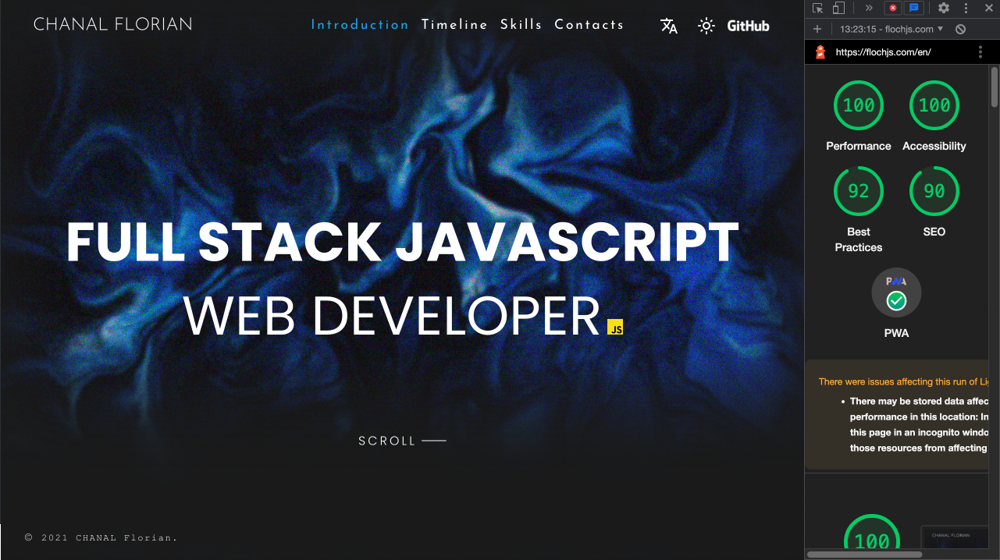

#### 🌒 My Resume



### Install

Install [nodejs](https://nodejs.org/en/)

Clone repository.

```
$ cd my-resume
$ npm install
```

### Test

To launch unit tests, run:

```
$ npm run test
```

To check coverage:

```
$ npm run test --coverage
```

### Lint

To lint all the Javascript/CSS sources, run:

```
$ npm run lint
```

### Run

To run in development mode, run:

```
$ npm run start
```
